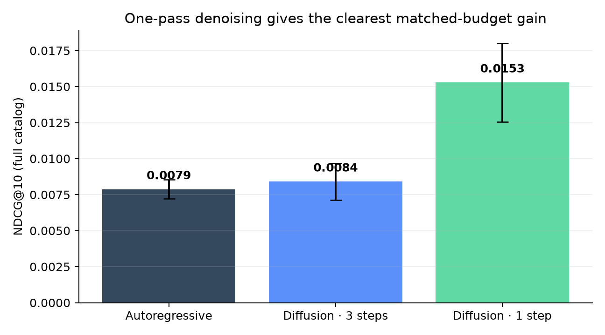
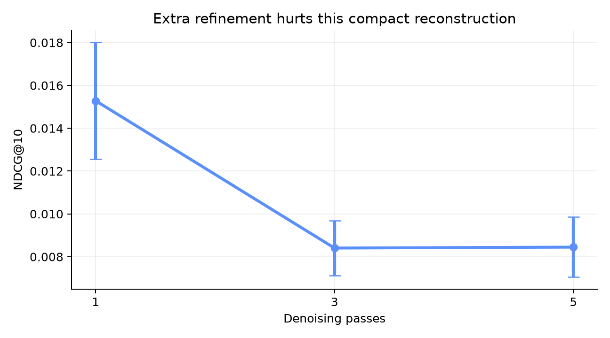
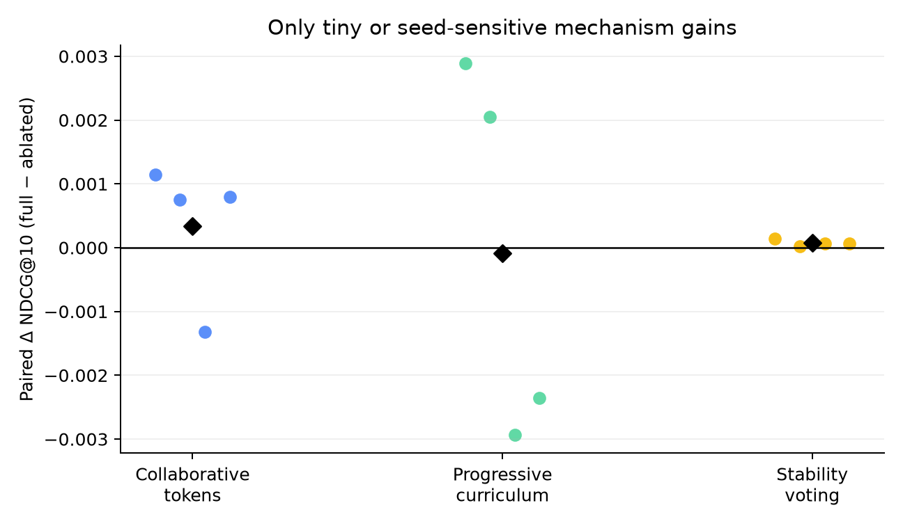
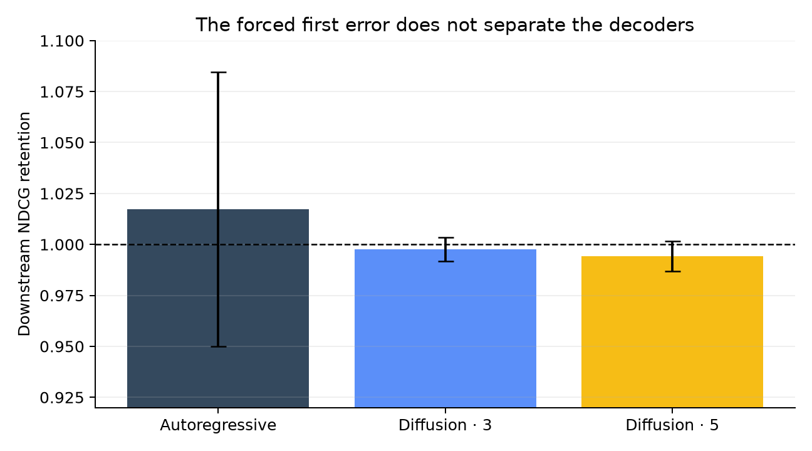
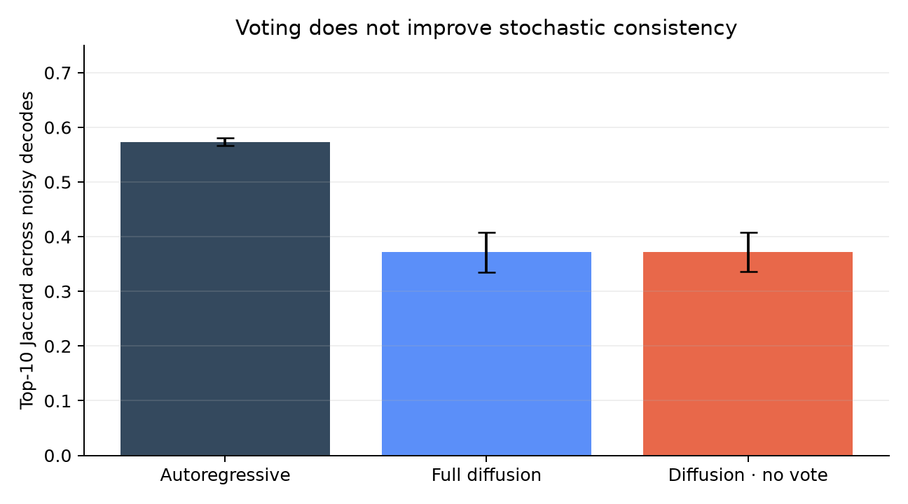

# Can a Tiny Denoiser Recommend Better Than a Left-to-Right Model?

Recommendation is less like completing a sentence than recovering a person’s interests from a scattered viewing history. The paper *Diffusion Language Model for Recommendation* proposes filling in masked preference tokens in both directions, with repeated refinement, instead of committing to one item at a time. This reproduction asks whether that core advantage and its supporting mechanisms survive in a small, controlled MovieLens setting.

## Verdict

**Partially reproduced.** At the same 893,568-parameter budget, one-pass masked denoising nearly doubled full-catalog NDCG@10 over autoregressive generation (0.01528 vs 0.00787; +94.2%) and Recall@10 (0.03150 vs 0.01665; +89.1%) across four seeds. The paper’s full three-step recipe produced a smaller NDCG gain (+6.8%) but lower Recall (−7.6%); graph tokens helped modestly, while progressive corruption, stability voting, and early-error correction were not consistently supported.

**Scope.** Fresh post-cutoff runs used the public MovieLens-1M ratings, a per-user chronological `train[:-3] / test[-3:]` split, full-catalog ranking, four seeds, and compact models reconstructed from the paper rather than its 8B implementation.

Higher is better; error bars are 95% normal intervals over four seeds. The clearest signal is the one-step denoiser. Three refinement passes erase most of that advantage, making the claim depend strongly on decoding depth.

## What was reconstructed

Every model used the same two-layer, width-128 Transformer, context length 40, three held-out targets, 14 epochs, and 0.89M parameters. The causal model predicts targets left to right. The diffusion model sees three masked target slots with bidirectional attention and reconstructs them together.

The paper’s CAST tokenizer was approximated by two LightGCN-style propagation hops over the training graph, hop-wise k-means codes, and learned code embeddings. Its two-stage curriculum became progressive history-item and target-token corruption. Stability voting aggregates log probabilities across refinement steps unless a token is already stable. These are documented, deliberately small reconstructions—not the paper’s stochastic quantizer, text prompts, preference loss, or LLaDA-8B backbone.

MovieLens here retained all 1,000,209 interactions from 6,040 users and 3,706 movies. The paper instead reports a filtered timepoint split with 574,684 interactions, 6,035 users, and 3,201 items, so absolute scores are contextual: its full DLMRec reports Recall@10 0.0828 and NDCG@10 0.1113; this compact one-step model reached 0.03150 and 0.01528.

## Finding 1: denoising helps, but refinement does not

| Model | Recall@10 | NDCG@10 | Assessment |
|---|---:|---:|---|
| Autoregressive | 0.01665 | 0.00787 | matched control |
| Full diffusion, 3 steps | 0.01538 | 0.00841 | quality mixed |
| Diffusion, 1 step | **0.03150** | **0.01528** | aligned with headline claim |
| Diffusion, 5 steps | 0.01552 | 0.00845 | no added benefit |

The one-pass result aligns with the broad claim that bidirectional masked reconstruction can beat left-to-right generation at small scale. It does not validate iterative correction: unlike the paper’s MovieLens optimum at three steps, this reconstruction peaks at one.

## Finding 2: the mechanisms are seed-sensitive

The graph codes improved mean NDCG by 0.00034 (4.2% relative to the ablation), but only three of four paired seeds favored them. Removing the curriculum slightly *increased* the four-seed mean, because seeds 0–1 strongly favored the curriculum while seeds 2–3 reversed the result. Voting gave a tiny, consistent mean increment of 0.000073—less than 1%.

This supports a weak contribution from collaborative tokenization, but the curriculum claim is inconclusive under this setup. Voting’s ranking effect is too small to distinguish from seed variation.

## Finding 3: no evidence of iterative error repair

Forcing the first generated target to a lower-ranked choice did not produce the paper-motivated separation. Downstream NDCG retention was 1.018 for the causal model, 0.998 for three-step diffusion, and 0.994 for five-step diffusion. Values near one mean the perturbation barely changed later ranks; values above one reflect noise, not a beneficial error.

Likewise, stability voting did not make noisy decodes more consistent: mean top-10 Jaccard was 0.371 with voting and 0.372 without it.

## Claim-by-claim assessment

| Paper claim | Observed evidence | Assessment |
|---|---|---|
| Matched denoising improves Recall and NDCG | One-step: +89.1% Recall, +94.2% NDCG; three-step: −7.6%, +6.8% | **Aligned for one pass; partial overall** |
| Collaborative tokenization contributes | +4.2% mean NDCG, 3/4 paired seeds positive | **Partially aligned** |
| Progressive item/token corruption contributes | −1.0% four-seed mean; sign reversed by seed cohort | **Inconclusive here** |
| Stability voting improves quality/consistency | +0.9% NDCG; no Jaccard gain | **Inconclusive here** |
| Iteration corrects early errors; three steps are best | no correction signal; one step clearly best | **Divergent under this setup** |

## Compute, provenance, and limitations

All scientific evidence came from OpenResearch Kubernetes jobs on **NVIDIA RTX PRO 6000 Blackwell Server Edition** GPUs. Each job allocated two GPUs, peak concurrency was **16 GPUs**, and the fresh campaign took **0.13 wall hours** from first launch through final completion; successful training/evaluation payloads took about 7.5–8.1 seconds per two-seed job after container setup. One root scout failed before Python due to shell quoting and contributes no evidence.

The strongest limitations are scale, a reconstructed tokenizer/schedule, different filtering and splitting, no text semantics, and only four seeds. A faithful reproduction would use the authors’ exact filtered timepoint data, CAST training losses, LLaDA-8B/LoRA prompt construction, hard-negative preference loss, and five independent runs. The public [experiment branches](https://github.com/alphaXiv/diffusion-language-model-for-recommendation/branches) preserve every code change; the [self-contained notebook](../../notebooks/dlmrec_reproduction.py) exposes all measurements and calculations.

