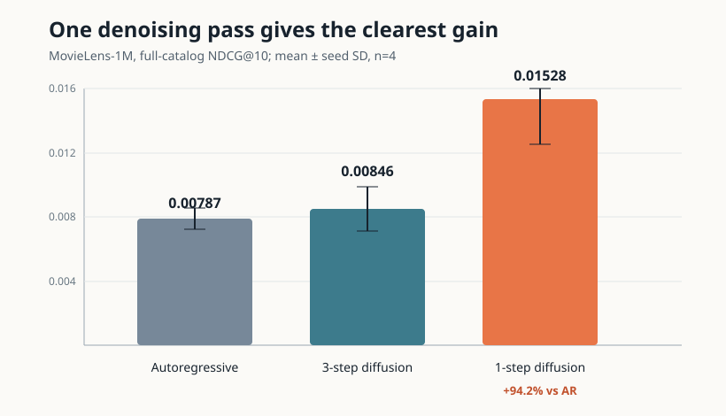
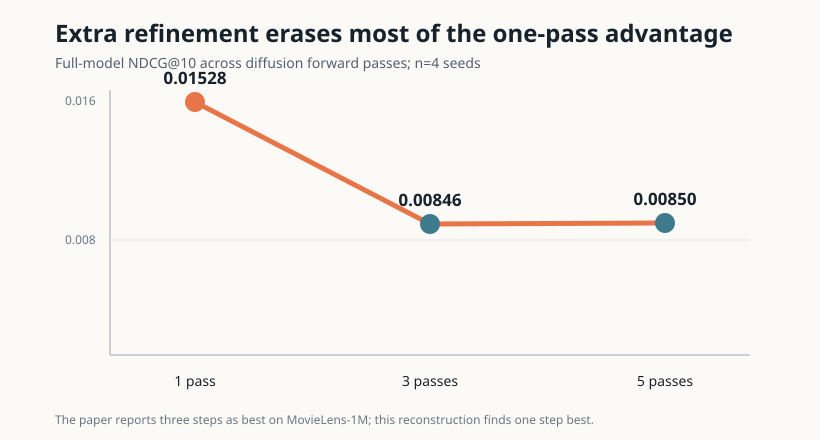
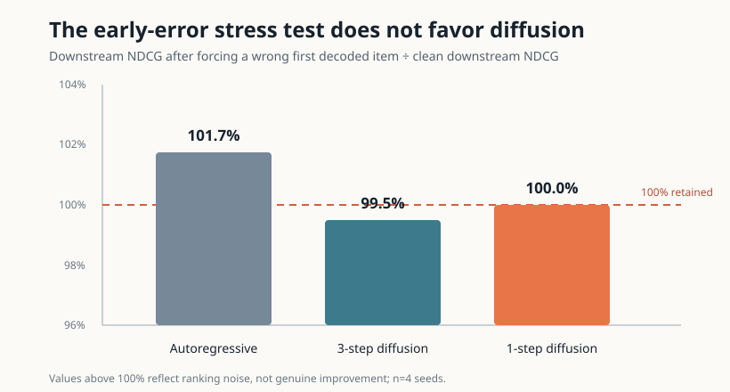
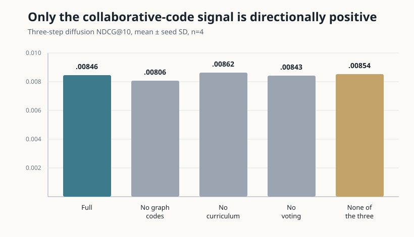
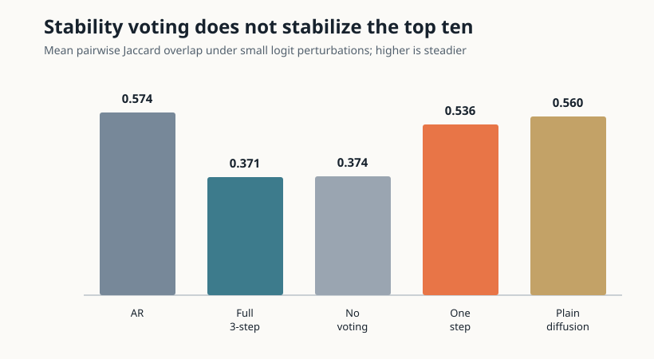

# Can masked denoising recommend the next movie better than left-to-right generation?

Recommendation models often predict choices one after another, so an early mistake can shape everything that follows. The paper *Diffusion Language Model for Recommendation* proposes instead hiding preference tokens and recovering them together, allowing information to flow in both directions. This reproduction asks whether that basic advantage survives in a compact model, and whether the paper’s graph tokenization, training curriculum, and voting ideas explain it.

**Verdict: partially reproduced.** A one-pass masked denoiser decisively beat a parameter-matched autoregressive model, but the paper-style three-pass version gave only a small, uncertain ranking gain, did not improve Recall@10 or early-error robustness, and did not validate curriculum or stability voting.

**Scope.** Four seeds, 6,040 users, 3,706 movies, 1,000,209 interactions, and a per-user chronological last-three split. Every formal run used Kubernetes on NVIDIA RTX PRO 6000 Blackwell GPUs, with a peak of 16 GPUs concurrently allocated and 0.1153 hours (6m55s) of elapsed pod wall time.

The bars show full-catalog NDCG@10 averaged across four matched seeds; error bars are seed standard deviations. One denoising pass reaches **0.01528**, versus **0.00787** for autoregression—a 94.2% relative increase whose paired 95% interval is entirely positive. The three-pass configuration is only 7.5% higher than autoregression, and its interval crosses zero.

The [self-contained notebook](../../notebooks/dlmrec_reproduction.py) contains every seed value and interactive tables. The exact public Molab URL is `https://molab.marimo.io/github/alphaXiv/diffusion-language-model-for-recommendation/blob/main/notebooks/dlmrec_reproduction.py`.

## What the paper claims

On its filtered MovieLens-1M split, the paper reports DLMRec at Recall@10 **0.0828** and NDCG@10 **0.1113**, compared with the strongest listed baseline at 0.0783 and 0.1078. Its preliminary matched-scale comparison says discrete diffusion improves both metrics over causal generation. It also reports that collaborative-aware tokenization and item/token masking ablations reduce quality, while three denoising steps work best on MovieLens-1M.

Those absolute numbers are not directly comparable here. The paper fine-tunes an 8B-parameter language model with item text, learned stochastic quantization, and a global timepoint split retaining 574,684 interactions. This reconstruction uses a 893,568-parameter transformer, no text, deterministic hop-wise quantization, and all ratings as implicit feedback. It tests the named public dataset and mechanisms, not exact system parity.

## Implementation walkthrough

Each user’s final three movies are held out; earlier interactions form both training sequences and a user–item graph. The shared two-layer transformer has 128-wide embeddings and exactly 893,568 parameters in every condition.

The autoregressive model uses a causal attention mask and predicts held-out items left to right. The diffusion model uses bidirectional attention, corrupts held-out tokens, and reconstructs them. Two rounds of LightGCN-style mean propagation over random item features are independently quantized into 64 graph codes per hop; learned code embeddings are added to the same item embedding table. The progressive curriculum increases target-token masking from 25% to 100% and history masking from 2% to 20%. At inference, optional voting sums log-probabilities across refinement steps for unstable positions.

Evaluation ranks every unseen catalog item. Besides Recall@10 and NDCG@10, a stress test forces the first generated item to the tenth-ranked choice, then measures the remaining two positions. Small logit perturbations repeated three times provide a top-10 Jaccard consistency diagnostic.

## Finding 1: denoising helps, but refinement hurts

| Method | Recall@10 | NDCG@10 | NDCG change vs AR |
|---|---:|---:|---:|
| Autoregressive | 0.01665 ± 0.00119 | 0.00787 ± 0.00067 | — |
| One-step diffusion | **0.03150 ± 0.00465** | **0.01528 ± 0.00279** | **+94.2%** |
| Three-step diffusion | 0.01559 ± 0.00183 | 0.00846 ± 0.00137 | +7.5% |
| Five-step diffusion | 0.01556 ± 0.00193 | 0.00850 ± 0.00147 | +8.0% |

All four seeds favor one-step diffusion over autoregression. Repeatedly feeding hard predictions back into this compact reconstruction likely reinforces them instead of correcting them. This aligns with the broad denoising claim but diverges from the paper’s three-step optimum.

## Finding 2: no early-error advantage

Three-step diffusion retains 99.5% of clean downstream NDCG, while autoregression retains 101.7%; the latter value above 100% is sampling variation, not improvement. The diffusion model never corrected the deliberately wrong first token under its hard-update rule. The paper’s error-correction mechanism is therefore **inconclusive to unsupported in this reconstruction**, not contradicted at full scale.

## Finding 3: tailored mechanisms do not add cleanly

Graph codes are directionally useful: the full model’s NDCG is 4.9% above the no-code ablation, though the paired interval crosses zero. Removing the curriculum slightly improves the four-seed mean, reversing the initial two-seed result. Removing voting changes NDCG by only 0.4%.

Voting also fails its intended consistency test: Jaccard is 0.371 with voting and 0.374 without it. The plain denoiser matches the full model within noise. Thus collaborative tokenization receives limited support; progressive corruption and stability voting do not.

## Claim-by-claim assessment

| Claim | Paper evidence | Observed evidence | Assessment | Compute |
|---|---|---|---|---|
| Denoising improves top-k quality | Matched preliminary study improves Recall/NDCG | One-step: +94.2% NDCG, +89.1% Recall; three-step: +7.5% NDCG, −6.4% Recall | **Aligned for one pass; partial overall** | 4 seeds/method, two 2-GPU jobs |
| Denoising resists early errors | Iterative bidirectional correction | No downstream advantage; 0% forced-token correction | **Inconclusive/unsupported here** | Same runs |
| Collaborative tokenization helps | Removing CAST degrades all datasets | +4.9% NDCG, uncertain across seeds | **Partially aligned** | 4 seeds/variant |
| Progressive corruption helps | Item/token masking ablations degrade | Full is 1.8% below no-curriculum mean | **Not shown here** | 4 seeds/variant |
| Stability voting helps consistency | Stable positions and trajectory votes improve reliability | 0.4% NDCG; Jaccard slightly lower | **Not shown here** | 4 seeds/variant |

## Limitations and bottom line

This is a mechanism-focused reproduction, not an 8B-model replication. The tokenizer is a documented graph reconstruction, item text is omitted, the split differs, and four seeds leave wide intervals for small effects. The strongest result is nevertheless clear: bidirectional masked prediction can be much better than causal generation at the same small-model budget, but iterative hard refinement can erase that advantage. A faithful follow-up needs the paper’s released tokenizer, text prompts, LLaDA backbone, global split, and soft confidence-guided updates before judging the unsupported mechanisms.
